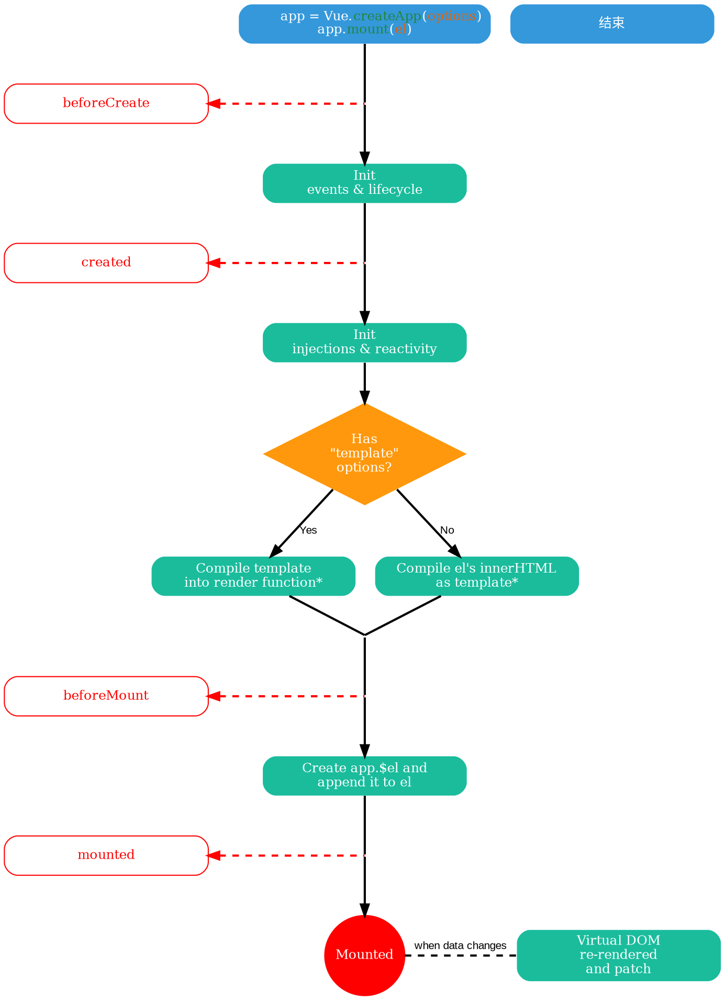
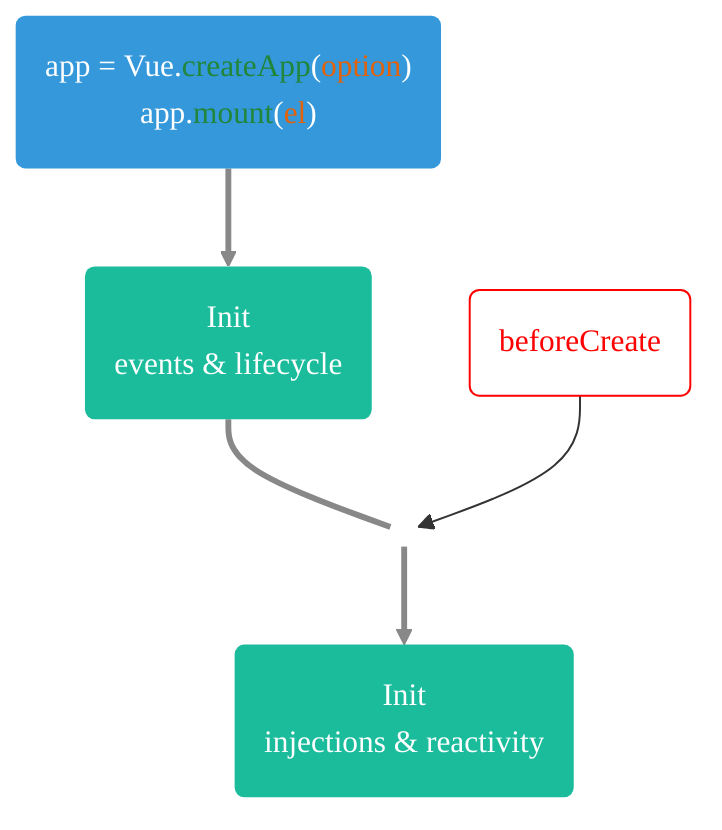

# 临时

```dot
digraph {
    /* 颜色定义
       变量 = #e36209 (橙色)
       方法 = #22863a (绿色) */
    // splines=ortho;

    // 全局样式
    node [style="filled, rounded" width=2.6 height=0.5 penwidth=0 fontcolor=white fontsize="12px"];

    // 开始、结束节点
    node [class="start-node, end-node" shape=box fillcolor="#3498db" ];
    start [label=<
        app = Vue.<font color="#22863a">createApp</font>(<font color="#e36209">options</font>)<br/>
        app.<font color="#22863a">mount</font>(<font color="#e36209">el</font>)
        >];
    end [label="结束" class="end-node"];
    
    // 中间节点
    node [class="step-node" fillcolor="#1abc9c"];
    step1 [label="Init\nevents & lifecycle" ];
    step2 [label="Init\ninjections & reactivity"];
    step3 [label="Compile template\ninto render function*"];
    step4 [label="Compile el's innerHTML\nas template*"];
    step5 [label="Create app.$el and\nappend it to el"];
    step6 [label="Virtual DOM\nre-rendered\nand patch"];
    
    // 分支节点
    node [class="branch-node" style=filled shape=diamond fillcolor="#FF980c"];
    branch1 [label="Has\n\"template\"\noptions?"];
    
    // 注释节点
    node [class="note-node" shape=box style="filled, rounded" penwidth=1 color=red fillcolor=none fontcolor=red];
    note1 [label="beforeCreate"];
    note2 [label="created"];
    note3 [label="beforeMount"];
    note4 [label="mounted"];

    // 圆形节点
    node [class="circle-node" width=1.0 fillcolor=red fontcolor=white shape=circle];
    circle1 [label="Mounted"];

    // 不可见转折点
    node [style=invis shape=point width=0 height=0 label=""];
    point1; point2; point3; point4; point5;

    // 布局控制
    { rank=same; start; }
    { rank=same; point1; note1; }
    { rank=same; step1; }
    { rank=same; point2; note2; }
    { rank=same; step2; }
    { rank=same; branch1; }
    { rank=same; step3; step4; }
    { rank=same; point3; }
    { rank=same; note3; point4; }
    { rank=same; step5; }
    { rank=same; note4; point5; }
    { rank=same; circle1; step6}
    { rank=same; end; }

    // 流程连接
    edge [color="#888" penwidth=2 style=solid fontname=Arial fontsize=10];
    start -> point1 [dir=none];
    point1 -> step1 [dir=forward];
    step1 -> point2 [dir=none];
    point2 -> step2 [dir=forward];
    step2 -> branch1;
    branch1:ws -> step3[label="Yes"];
    branch1:es -> step4 [label="No"];
    step4 -> point3 [dir=none];
    step3 -> point3 [dir=none];
    point3 -> point4 [dir=none];
    point4 -> step5 [dir=forward];
    step5 -> point5 [dir=none];
    point5 -> circle1;
    circle1 -> step6 [style=dashed splines=curved label="when data changes" dir=none];
    
    // 注释连接
    edge [style=dashed color=red dir=back minlen=4];
    note1 -> point1;
    note2 -> point2;
    note3 -> point4;
    note4 -> point5;
}
```

```mermaid
flowchart TD
%% 颜色定义
%% 变量 = #e36209 (橙色)
%% 方法 = #22863a (绿色)

%% 定义样式类
classDef default font-family: Monaco, Consolas, monospace
classDef start-node fill: #3498db, stroke: none, color: white
classDef step-node fill: #1abc9c, stroke: none, color: white
classDef note-node fill: none, stroke: red, color: red
classDef invisible fill: none, stroke: none, minHeight: 0px,minWidth: 0px

%% 定义节点
%% 开始节点
start("app&nbsp;=&nbsp;Vue.<font color = #22863a>createApp</font>(<font color = #e36209>option</font>)<br>app.<font color = #22863a>mount</font>(<font color = #e36209>el</font>)");

%% 中间节点
step1("Init<br>events&nbsp;&&nbsp;lifecycle");
step2("Init<br>injections&nbsp;&&nbsp;reactivity");

%% 注释节点
note1("beforeCreate");

%% 不可见节点
spacer1(("​"));

%% 应用样式
class start start-node
class step1,step2 step-node
class note1 note-node
class spacer1 invisible

%% 设置流程
start --> step1 --- spacer1 --> step2

linkStyle 0,1,2 stroke: #888, stroke-width: 3px

note1 --> spacer1
```
