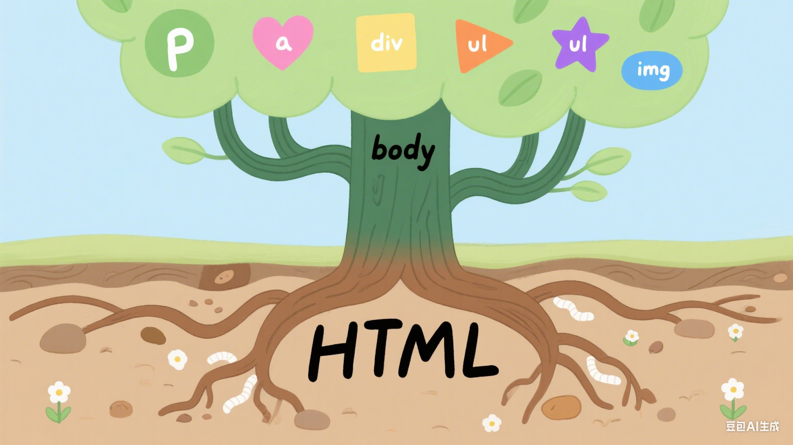

## DOM概述

DOM是JavaScript操作网页的接口，全称为“文档对象模型” (Document Object Model) 。它的作用是将网页转为一个JavaScript对象，从而可以用脚本进行各种操作（比如对元素增删内容）。

浏览器会根据DOM模型，将结构化文档HTML解析成一系列的节点，再由这些节点组成一个树状结构 (DOM Tree) 。所有的节点和最终的树状结构，都有规范的对外接口。

DOM只是一个接口规范，可以用各种语言实现。所以严格说，DOM不是JavaScript语法的一部分，但是DOM操作是JavaScript最常见的任务，离开了DOM，JavaScript就无法控制网页。另一方面，JavaScript也是最常用于操作DOM的语言。

### 节点

DOM的最小组成单位叫做节点 (node) 。文档的树状结构 (DOM树) ，就是由各种不同类型的节点组成。每个节点可以看作是文档树的一片叶子。



常用的节点的类型有七种。

>Document: 整个文档树的顶层节点
>DocumentType: doctype标签
>Element: 网页的各种HTML标签
>Attribute: 网页元素的属性（比如class = "right"）
>Text: 标签之间或标签包含的文本
>Comment: 注释
>DocumentFragment: 文档的片段

### 节点树

一个文档的所有节点，按照所在的层级，可以抽象成一种树状结构。这种树状结构就是DOM树。它有一个顶层节点，下一层都是顶层节点的子节点，然后子节点又有自己的子节点，就这样层层衍生出一个金字塔结构，倒过来就像一棵树。

浏览器原生提供document节点，代表整个文档。

```html
document
<!-- 整个文档树 -->
```

除了根节点，其他节点都有三种层级关系。

>父节点关系 (parentNode) ：直接的上级节点
>子节点关系 (childNode) ：直接的下级节点
>同级节点关系 (sibling) ：拥有同一个父节点的节点

### Node.nodeType属性

不同节点的nodeType属性值和对应的常量如下

>文档节点 (document) ：9，对应常量Node.DOCUMENT_NODE
>元素节点 (element) ：1，对应常量Node.ELEMENT_NODE
>属性节点 (attr) ：2，对应常量Node.ATTRIBUTE_NODE
>文本节点 (text) ：3，对应常量Node.TEXT_NODE
>文档片段节点 (DocumentFragment) ：11，对应常量Node.DOCUMENT_FRAGMENT_NODE
>注释节点 (Comment)：8，对应的常量Node.COMMENT_NODE

```javascript
console.log(document.nodeType)
console.log(document.nodeType === Node.DOCUMENT_NODE)
```

输出结果

```console
9
true
```
