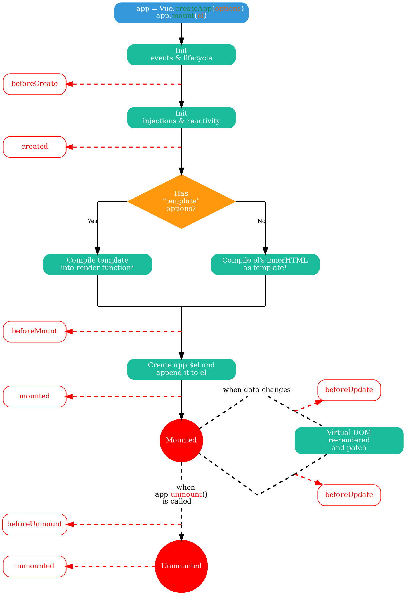

## 组件生命周期

每个组件在被创建时都要经过一系列的初始化过程————例如，需要设置数据监听、编译模板、将实例挂载到DOM并在数据变化时更新DOM等。同时在这个过程中也会运行一些叫做**生命周期钩子**的函数，这给了用户在不同阶段添加自己的代码的机会。



为了方便记忆，可以将它们分类

创建时：`beforeCreate`、`created`

渲染时：`beforeMount`、`mounted`

更新时：`beforeUpdate`、`updated`

卸载时：`beforeUnmount`、`unmounted`

其中`beforeCreate`、`created`两个生命周期函数在选项式API中可以被调用，而在组合式API中无需使用。

下面使用组合式API的方式演示一下几个生命周期函数

创建`组件生命周期.vue`

```vue
<template>
    <h3>生命周期函数</h3>
    <p>{{ message }}</p>
    <button @click="message='数据改变'">更新数据</button>
</template>

<script setup>
import { onBeforeMount, onBeforeUnmount, onBeforeUpdate, onMounted, onUnmounted, onUpdated, ref } from 'vue'

const message = ref("")

onBeforeMount(() => {
    console.log("beforeMount: 渲染之前")
})

onMounted(() => {
    console.log("mounted: 组件渲染完成")
})

onBeforeUpdate(() => {
    console.log("beforeUpdata: 组件更新之前")
})

onUpdated(() => {
    console.log("updated: 组件更新完成")
})

onBeforeUnmount(() => {
    console.log("beforeUnmount: 组件卸载之前")
})

onUnmounted(() => {
    console.log("unmounted: 组件卸载之后")
})
</script>
```

在`App.vue`中引入`组件生命周期.vue`组件

```vue
<template>
  <button @click="showLifecycle = !showLifecycle">
    {{ showLifecycle ? '卸载' : '加载' }}生命周期组件
  </button>
  <Lifecycle v-if="showLifecycle" />
</template>

<script setup>
import { ref } from "vue"
import Lifecycle from "./components/组件生命周期.vue"

const showLifecycle = ref(true)
</script>
```

运行之后会在控制台依次打印

```console
beforeMount: 渲染之前
mounted: 组件渲染完成
```

当点击“更新数据”按钮之后`message`的值更改为`数据改变`，同时控制台依次打印

```console
beforeUpdata: 组件更新之前
updated: 组件更新完成
```

点击“卸载生命周期组件”按钮后，控制台依次打印

```console
beforeUnmount: 组件卸载之前
unmounted: 组件卸载之后
```
